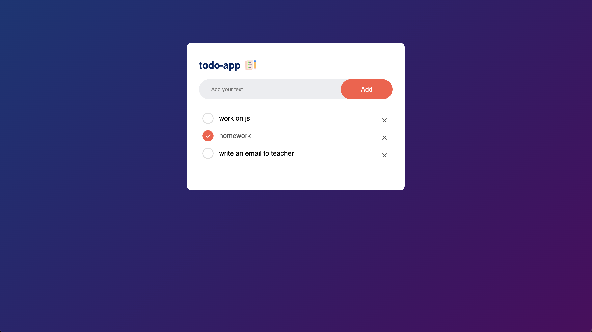

# 📝 TaskMaster - Modern To-Do List App

  

A clean, responsive, and interactive To-Do List application. This project demonstrates DOM manipulation, Event Handling, and Local Storage implementation in Vanilla JavaScript.

## 🚀 Live Demo
### [👉 Click here to view the Live App](https://ramanyadavone.github.io/todo-list/)

---

## 📸 Screenshot


---

## ✨ Key Features

* **Create Tasks:** Clear input field with validation (prevents empty tasks).
* **Edit Mode ✏️:** Update existing tasks without deleting them (fixes typos instantly).
* **Mark as Done:** Visual cues (strikethrough & grayed out) for completed items.
* **Delete Tasks:** Remove items permanently from the list.
* **Persistent Data 💾:** Uses **Local Storage** to save your tasks. They stay even if you refresh or close the browser!
* **Keyboard Support:** Press `Enter` to add tasks quickly.
* **Responsive UI:** Works on Mobile, Tablet, and Desktop.

---

## 🛠️ Tech Stack

* **Frontend:** HTML5, CSS3
* **Logic:** JavaScript (ES6+)
* **Hosting:** GitHub Pages

---

## 📂 How to Run Locally

If you want to view the code on your own machine:

1.  **Clone the repository:**
    ```bash
    git clone [https://github.com/ramanyadavone/todo-list.git](https://github.com/ramanyadavone/todo-list.git)
    ```
2.  **Open the project:**
    Go to the folder and double-click `index.html`.

---

## 🧠 What I Learned

Building this project helped me understand:
1.  **CRUD Operations:** Creating, Reading, Updating, and Deleting data elements.
2.  **DOM Manipulation:** How to use `createElement`, `appendChild`, and `addEventListener`.
3.  **Local Storage API:** How to parse JSON data to keep app state between sessions.

---

## 👤 Author

**Raman**

* Check out my GitHub: [@ramanyadavone](https://github.com/ramanyadavone)

---

*This project is open source and available under the [MIT License](LICENSE).*
